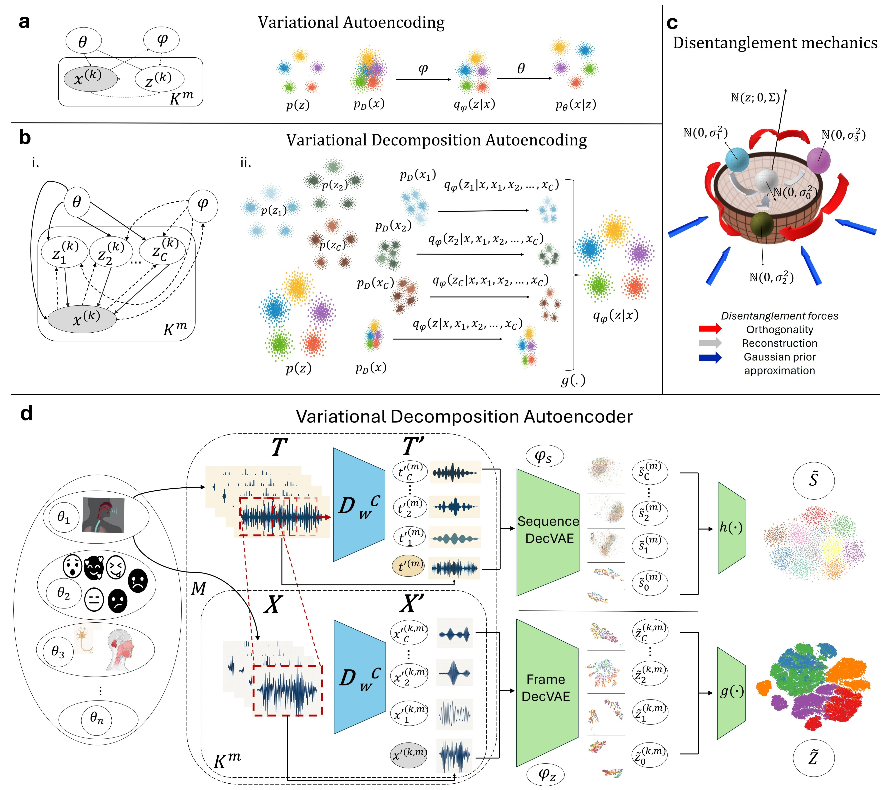

# Variational Decomposition Autoencoders (DecVAE)

**Codebase repository for paper: "Variational decomposition autoencoding improves disentanglement of latent representations"**

Understanding the structure of complex, nonstationary, high-dimensional time-evolving signals is a central
challenge in scientific data analysis. In many domains, such as speech and biomedical signal processing, the abil
ity to learn disentangled and interpretable representations is critical for uncovering latent generative mechanisms.
Traditional approaches to unsupervised representation learning, including variational autoencoders (VAEs), of
ten struggle to capture the temporal and spectral diversity inherent in such data. Here we introduce variational
decomposition autoencoding (VDA), a framework that extends VAEs by incorporating a strong structural bias
toward signal decomposition. VDA is instantiated through variational decomposition autoencoders (DecVAEs),
i.e., encoder-only neural networks that combine a signal decomposition model, a contrastive self-supervised
task, and variational prior approximation to learn multiple latent subspaces aligned with time-frequency char
acteristics.

This library contains ```DecVAEs``` and numerous utilities/scripts for pre-training, fine-tuning transfer learning and zero-shot transfer learning of ```DecVAEs```, evaluation of ```DecVAE``` representations through disentanglement and task-specific metrics, and latent analysis tools for interpretability.``` DecVAEs``` are built by adapting the 🤗 Wav2Vec2-encoder architecture to include VAE functionality for disentangled representation learning. We accommodate the analysis of 4 datasets: TIMIT, IEMOCAP, VOC-ALS and SimVowels, a custom simulated speech dataset. Paper figures can be generated using R (```visualize_R```). Implementation is based on PyTorch, 🤗 HuggingFace Transformers and Google Research ```google-research/disentanglement_lib```. This codebase also support logging of pre-training and post-training through Weights & Biases 
 @wandb. 

## Method highlights



Our method employs a novel variational decomposition autoencoder (DecVAE) architecture with several key innovations:

- **Enhanced disentanglement, generalizability and interpretability** in disentangling two and more factors of variation in simulated speech, real speech, dysarthric speech and emotional speech.
- **Zero-shot capability extending to unseen generative factors** when pre-training in datasets with less generative factors and applied to new domains with new unseen generative factors. 
- **Decomposition of the latent space**: DecVAE assumes a generative process that is expressed through multiple frequency-resonant latent subspaces.
- **Signal decomposition model**: DecVAE utilizes a signal decomposition model that decomposes inputs in C components (C masked views of the input signal), that share information with the initial input, are time-frequency orthogonal to each other and their superposition reconstructs the input signal. This creates positive (initial signal-component) and negative (component-component) pairs. Initial signal and components are propagated through the shared encoder; the latent representation space is forced to retain the orthogonality and reconstruction properties of the input space.  
- **Prior (Gaussian) approximation**: DecVAE retains the prior approximation functionality of beta-VAE-based models.
- **Latent reconstruction and orthogonality**: variational decomposition autoencoding contains two novel disentanglement mechanisms: latent signal reconstruction and orthogonality. In total, DecVAE disentangles through 3 distinct mechanisms (latent reconstruction, latent orthogonality, latent prior approximation). 
- **Novel adversarial divergence objective**: DecVAE is pre-trained with a self-supervised contrastive loss inspired by the signal decomposition dynamics of reconstruction and orthogonality. The loss forces minimal divergences for the positive pairs (initial signal-components) and maximal divergences for the negative pairs (component-component) at the same time.
- **Encoder-only**: The current version of DecVAE is a variational encoder-only disentangling autoencoder; adding generative capabilities is currently a work in progress. The role of the decoder is replaced by the latent reconstruction.
- **Dual-branch Architecture**: Supports simultaneous processing of multiple time scales for slow and fast varying generative factors (e.g. frame and sequence level).

## Installation instructions (Ubuntu 22.04, Windows 11)
```bash
# Clone repository
git clone https://github.com/GiannisZgs/DecVAE.git
cd DecVAE
```

### 1. Python Environment

**Using Conda**
```bash
conda env create -f env_setup/decVAE_conda.yml
conda activate DecVAE
```

**Using pip only**
```bash
pip install -r env_setup/decVAE_pip_requirements.txt
```

*Note: The `.yml` file creates a Conda environment with Python 3.11.9 and installs all packages from `.txt` via pip. If using Conda, you only need the `.yml` file.*

### 2. R Dependencies

Install R packages:
```bash
Rscript env_setup/setup.R
```

## Reproducibility

All experiments are fully reproducible with the provided code and configurations. We provide:

- **Complete source code** for all model components and training procedures to reproduce the whole training process and evaluation of DecVAEs (```scripts```) .
- **Configuration files** for reproducing experiments in the paper (```config_files```).
- **Evaluation protocols** for assessing disentanglement and downstream performance.
- **Analysis products** for reproducing figures (```figures```, ```supplementary_figures```) in the paper without the need of pre-training the models from scratch (```data```).
- **Visualization utilities** for reproducing figures in the paper (```visualize_R``` and ```scripts/visualize```).
- **Examples** for various use cases in ```examples/notebooks```.

## Example: Disentanglement of simulated speech data (SimVowels dataset) 

### SimVowels data generation
To generate the SimVowels dataset run the below after setting up the environment:

```bash
python scripts/simulations/simulated_vowels.py
```

or download SimVowels directly from https://drive.google.com/drive/folders/1VE4mkC3P1GEDrorThmRgL07NdEoLtyf9?usp=sharing.

### Input visualization - 2D, 3D TSNE and/or UMAP manifolds, colored by generative factors and frequency 
To visualize the inputs (frame-level) to the models:

```bash
accelerate launch scripts/visualize/low_dim_vis_input.py --config_file config_files/input_visualizations/config_visualizing_input_frames_vowels.json
```

To visualize the inputs (sequence-level) to the models:

```bash
accelerate launch scripts/visualize/low_dim_vis_input.py --config_file config_files/input_visualizations/config_visualizing_input_sequences_vowels.json
```

For more details on setting crucial input visualization parameters, see ```args_configs/visualization_args```.

### Pre-training of a DecVAE
Uses the ```accelerate``` library. ```accelerate``` can be configured to set the desired hardware to run on along with other settings (see ```accelerate config```).

For single-GPU training:
```bash
accelerate launch scripts/pre-training/base_models_ssl_pretraining.py --config_file config_files/DecVAEs/sim_vowels/pre-training/config_pretraining_sim_vowels_NoC3.json
```

For multi-GPU training or to specify a GPU id:
```bash
accelerate launch --gpu_ids 0,1 scripts/pre-training/base_models_ssl_pretraining.py --config_file config_files/DecVAEs/sim_vowels/pre-training/config_pretraining_sim_vowels_NoC3.json
```

Running the pre-training requires:
- The raw dataset.

Running the pre-training will yield:
1) the decomposed inputs, saved in the directories specified by the ```train~validation~test_cache_file_name``` parameters.
2) model ```.safetensors``` checkpoints that will be saved in the directory specified by the ```output_dir``` argument in the ```config_file```, along with the current ```config_file``` used.

Some important DecVAE pre-training parameters include:
- ```with_wandb: bool``` : whether to use Weights & Biases logger to monitor training.
- ```input_type = "mel"```: "mel" or "waveform", the type of inputs to the models (decomposition is always performed in the time domain, before feature extraction).
- ```per_device_train_batch_size=16```: batch size (in utterances).
- ```learning_rate=[8e-5,1e-4]```: learning rate for each time scale [frame,sequence]. 
- ```lr_scheduler_type=["constant_with_warmup","linear"]```: learning rate scheduler for each time scale [frame,sequence]. 
- ```num_train_epochs=150```: maximum number of epochs.
- ```early_stop_warmup_steps=28000```: warmup steps before applying early stop with a patience after no improvement in the validation loss, based on a threshold.
- ```dual_branched_latent=true```: whether to use both time scales in DecVAEs. ```only_z_branch=true``` and ```only_s_branch=true``` set single time scale training.
- ```beta_kl_prior_z```: the beta value for the prior approximation objective in the combined loss for the Z (frame) variable. ```beta_kl_prior_s``` is the corresponding parameter for the S (sequence) variable.
- ```decomp_to_perform```: method to use for the decomposition model - ```filter,ewt,vmd,emd```.
- ```NoC, NoC_seq```: number of components to decompose frames and sequences into.
- ```save_model=true```: whether to save model checkpoints during training or not (in ```.safetensors``` format).
- ```saving_steps=2500```: a checkpoint of the model will be saved every ```saving_steps``` steps, and whenever the validation loss is minimized.
- ```max_frames_per_batch```: how many frames to use in the loss calculation per batch entry (per utterance).

For help on setting DecVAE parameters for the pre-training, see ```args_configs```.

### Latent evaluation - Calculate disentanglement and task-specific metrics
```bash
accelerate launch scripts/post-training/latents_post_analysis.py --config_file config_files/DecVAEs/sim_vowels/latent_evaluations/config_latent_anal_sim_vowels.json
```

Running the post training evaluation requires:
- a pre-trained DecVAE model ```.safetensors``` checkpoint.

Running the post-training evaluation can yield:
1) disentanglement metrics results and/or task-specific metrics results.

Some important DecVAE post-training parameters include:
- ```with_wandb: bool``` : whether to use Weights & Biases logger to log evaluation results.
- ```epoch_range_to_evaluate=[-1]```: will evaluate the last checkpoint in the ```parent_dir``` directory.
- ```aggregations_to_use=["all","OCs_joint"]```: the aggregation functions to evaluate ("all" = [X, OC1, OC2, ..., OCN], "OCs_joint"=[OC1, OC2, ... OCN]) 
- ```classification_tasks=["vowel","speaker_frame","speaker_seq"]```: what classification tasks to perform.
- ```classify=True```: whether to perform classification.
- ```measure_disentanglement```: whether to perform disentanglement evaluation


For more details on setting DecVAE parameters for the post-training evaluation, see ```args_configs```.

### Latent visualization - 2D, 3D TSNE and/or UMAP manifolds, colored by generative factors and frequency 
To visualize the latent representations (frame-level):

```bash
accelerate launch scripts/visualize/low_dim_vis_latents.py --config_file config_files/DecVAEs/sim_vowels/latent_visualizations/config_latent_frames_visualization_vowels.json
```
To visualize the latent representations (sequence-level):

```bash
accelerate launch scripts/visualize/low_dim_vis_latents.py --config_file config_files/DecVAEs/sim_vowels/latent_visualizations/config_latent_sequences_visualization_vowels.json
```

Running the post training latent visualization requires:
- a pre-trained DecVAE model ```.safetensors``` checkpoint.

Running the post-training evaluation yields:
1) TSNE and/or UMAP visualizations of latent representations will be saved in the directory specified by ```save_vis_dir```.

For more details on setting latent visualization parameters, see ```args_configs```.

### Latent traversals/response analysis
To perform latent traversal analysis for the SimVowels dataset, first generate a small-scale 
set where generative factors are controlled:

```bash
python scripts/simulations/simulated_vowels_for_latent_traversal.py
```

Then use pre-trained DecVAE models as a representation function to obtain the latent responses:

```bash
accelerate launch scripts/latent_response_analysis/latent_traversal_analysis.py --config_file config_files/DecVAEs/sim_vowels/latent_traversals/config_latent_traversals_sim_vowels.json
```

Running the post training latent traversal analysis requires:
- a pre-trained DecVAE model ```.safetensors``` checkpoint.

Running the post-training latent traversal analysis yields:
1) latent response matrices for every subspace in ```.json``` format. These are used to create the visualizations in R (see ```visualize_R```).

For more details on setting crucial latent traversals parameters, see ```args_configs```.

### More visualizations with R

Use the calculated results to create figures with R through the scripts at ```visualize_R```. See ```visualize_R/README``` for more details.

### Benchmarks and more datasets
The exact same process as above can be followed to pre-train and evaluate VAE-based models and ICA/PCA/kPCA, as well as DecVAE models for the other 3 supported datasets (TIMIT, VOC-ALS, IEMOCAP). The exact same scripts and config_files exist for VAEs. For details and parameters check ```args_configs``` and ```examples```.

## Citation
If you use this codebase in your research, please cite our paper and this codebase:

Ziogas I.N., Al Shehhi A., Khandoker A.H., and Hadjileontiadis L.J. Variational decomposition autoencoding improves disentanglement of latent representations. 

Ziogas I.N., Al Shehhi A., Khandoker A.H., and Hadjileontiadis L.J. Variational decomposition autoencoding improves disentanglement of latent representations. *Zenodo* [](https://doi.org/10.5281/zenodo.17773434)

## References
Wolf T. et al. Transformers: State-of-the-art natural language processing. *In Proceedings of the 2020
 Conference on Empirical Methods in Natural Language Processing: System Demonstrations*, pages 38–45,
 (EMNLP,2020).

Paszke A. et al. Pytorch: An imperative style, high-performance deep learning library. *Advances in neural
 information processing systems*, 32, (2019).

Shuangbin X., Chen M., Feng T., Zhan L., Zhou L., and Yu G. Use ggbreak to effectively utilize plotting
space to deal with large datasets and outliers. *Frontiers in Genetics*, 12, (2021).

Locatello F., Bauer S., Lucic M., Raetsch G., Gelly S., Sch¨olkopf B., and Bachem O. Challenging
Common Assumptions in the Unsupervised Learning of Disentangled Representations, *Proceedings of the 36th
International Conference on Machine Learning*, 97:4114–4124, (PMLR,2019).

B. Lukas. Experiment Tracking with Weights and Biases, *Software available from wandb.com at https://www.wandb.com/*, (2020)

## License 

[Apache License 2.0](LICENSE)


